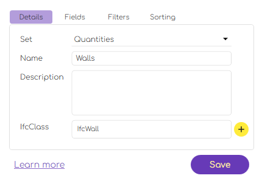

# Main Features  

G.DataManager is designed around a user-friendly, visually guided experience for managing project configurations and reusable BIM schedules. Here's how the core features translate into your workflow.  


---

### File Management  
> *(powered by `FileCommands`)*

Whether you're starting a new project or continuing an existing one, G.DataManager gives you simple tools for opening, saving, or creating project configurations:

- **Open** or **Create** a `.bds.config` file from the ribbon
- Manage configuration metadata like file name, path type, and responsible party  
  
- All changes can be saved locally or exported with just a click
- Project structure is saved in a lightweight, serialized format for fast reopening

---

### Project & Model Configuration  
> *(powered by `ConfigManageCommands`)*

Define the core of your project using intuitive forms:

- Enter project name, code, status, issue date, and address 

  

- Identify the organization, client, and file version metadata
- Link one or more IFC models to your configuration  

  

- Models are listed with path info and status, with simple add/remove buttons

---

### Schedule Editor  
> *(powered by `BdsCommands`)*

Create powerful data extraction templates in a visual way:

- Define schedule groups (e.g., Quantities, Room Book)
- Add new schedules.

  

- Select **IFC classes** to extract (e.g., `IfcWall`)
- Add fields using IFC attributes or property sets  

  

- Combine formulas, filters, and sorting rules for tailored outputs
- Preview the schedule data in a structured table view
- Export the results directly to `.xlsx` with styled headers and formats  
  
  

---

### Interactive Tree Navigation  

- All schedules are shown in a hierarchical **tree view** on the left
- Clicking an item loads its configuration in the right pane
- Selection updates automatically enable or disable relevant actions

---

# Usage Scenarios

### New Project Setup
1. Click `New` to create a `.bds.config` file
2. Fill in basic project info (name, code, org, client)
3. Link one or more IFC model files
4. Save your configuration for future editing

---

### Load Existing Configuration
1. Click `Open` and select a `.bds.config` file
2. G.DataManager will deserialize the file
3. You'll instantly see all models, schedules, and metadata populated

---

### Define a New Schedule
1. Click `Add Schedule`
2. Enter schedule name (e.g., *Walls*) and assign it to a set (*Quantities*)
3. Select IFC class (e.g., `IfcWall`)
4. Add fields like `IsTypedBy`, `Name`, `FireRating`, or custom properties
5. Define filters (e.g., `IsExternal = true`) and sort order
6. Save the schedule

---

### Export to Excel
1. Select a schedule in the tree
2. Click `Export`
3. Choose a file location
4. G.DataManager generates a well-structured `.xlsx` file, complete with styles, headers, and filters

---

## Example Workflow

```plaintext
New Project → Add Project Metadata → Link IFC Models → Define Schedules →
Save Config → Export to Excel → Reuse Across Projects