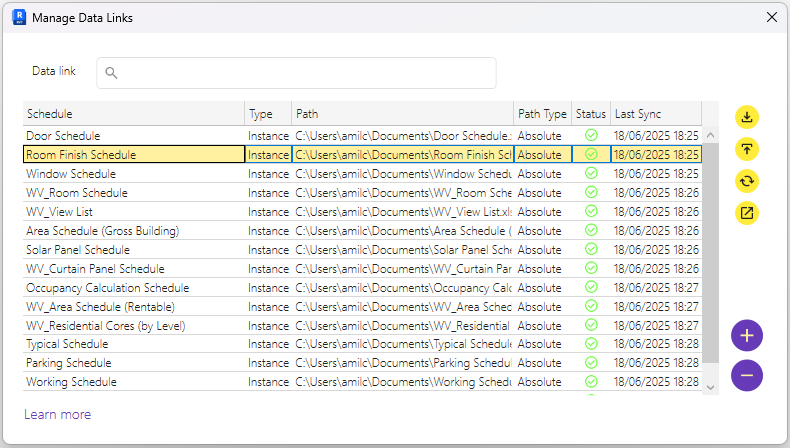

# Manage Data Links 
## Revit ↔ Excel Sync in G.plus

The **Manage Data Links** window is where you control the connections between Revit schedules and Excel spreadsheets.

### Main Table

Each row in the table represents a **live link** between a Revit schedule and an Excel file. These links allow you to sync model data with external spreadsheets — useful for stakeholders who work outside of Revit.

| Column       | Description |
|--------------|-------------|
| **Schedule** | The Revit schedule being linked |
| **Type**     | Indicates whether the link targets `Instance` or `Type` parameters |
| **Path**     | The file path of the linked Excel sheet |
| **Path Type**| Shows whether the path is `Absolute` or `Relative` |
| **Status**   | Indicates whether the Excel file is accessible and synced |
| **Last Sync**| Timestamp of the most recent synchronization |

### Right-side Actions (Sync Tools)

Each icon performs a sync action for the selected link:

- **Pull** — Updates the Revit schedule using the Excel file
- **Push** — Overwrites the Excel file with current Revit data
- **Sync** — Performs a smart two-way sync (based on changes)
- **Compare** — Opens a merge interface to review and resolve differences

### Add or Remove Links

- Removes the selected link from the list  
- Adds a new link between a Revit schedule and an Excel file  

---

> 💡 Use this tool to connect your BIM model with quantity takeoffs, asset registers, or room data sheets managed externally — without breaking the Revit workflow.

---
## Add a New Data Link

To create a new connection between a Revit schedule and an Excel file, click the **Add button** in the main interface.  
This opens the **New Data Link** dialog:

### Configuration Options

| Field           | Description |
|----------------|-------------|
| **Schedule**    | Select an existing Revit schedule you want to link with Excel |
| **Parameter Type** | Choose whether the data exchange will act on element `Instance` or `Type` parameters |
| **Path**        | Browse to select the Excel file (`.xlsx`) you want to link. Use the yellow folder button to open the file picker |
| **Path Type**   | `Absolute` (Stores the full path to the file) or `Relative` (Stores a path relative to the Revit project location) |

### Finalize the Link

Once all fields are configured:
- Click the **OK** button (purple circle) to create the link.
- The new link will appear in the **Manage Data Links** table, ready for push/pull/sync actions.
- The data will be pushed to the linked Excel file.
---

> 💡 You can create an Instance and a Type link for the same schedule.  

> 💡 You can link multiple Revit schedules to the same Excel file, but it will need a different sheet for each link.

---
## General Notes

- **Push Overwrites Everything**  
  When you **push** data to Excel, the entire content of the linked sheet will be **replaced** by the current Revit schedule. Any manual changes in Excel will be lost unless pulled beforehand.

- **Pull Respects Read-Only Parameters**  
  When you **pull** data from Excel, only **writable** parameters will be updated in Revit. Read-only fields (e.g., calculated values or system parameters) remain untouched.

- **Create or Delete Elements via Excel**  
  For supported categories like **Rooms, Spaces, Areas, and Sheets**, you can:
  - **Add new elements** by inserting new rows in Excel
  - **Remove elements** by deleting rows

- **Dynamic Column Mapping**  
  If you **add new columns** in the Excel sheet, G.plus will prompt you to:
  - **Map them** to existing parameters, or
  - **Create new shared parameters** automatically
---

> 💡 Use these capabilities to quickly bulk-edit schedules, populate new projects, or coordinate with non-Revit users — all from Excel.

---
## Selective Merge

The **Merge** window allows you to resolve conflicts between **Revit data** and the **linked Excel file**.  
This ensures you don’t have to overwrite everything — just what matters.

### How it Works

- **Left Panel**: Shows the current data from the **Revit model**
- **Right Panel**: Displays the data from the **Excel file**

Each row represents differences in elements (e.g., Room, Space, Area, or Sheet) being compared across both sources.

### Manual Conflict Resolution

- Use the **checkboxes** to manually select which rows to update.
- You can decide **line-by-line** whether to:
  - **Push** changes from Revit → Excel
  - **Pull** changes from Excel → Revit

This selective approach gives you **granular control**, avoiding full overwrites and reducing the risk of data loss.

> 💡 Ideal for collaborative workflows where teams update Excel files in parallel with Revit development.

### Finalize Changes

After reviewing and selecting desired rows, click **OK** to apply the merge based on your selections.
