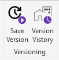
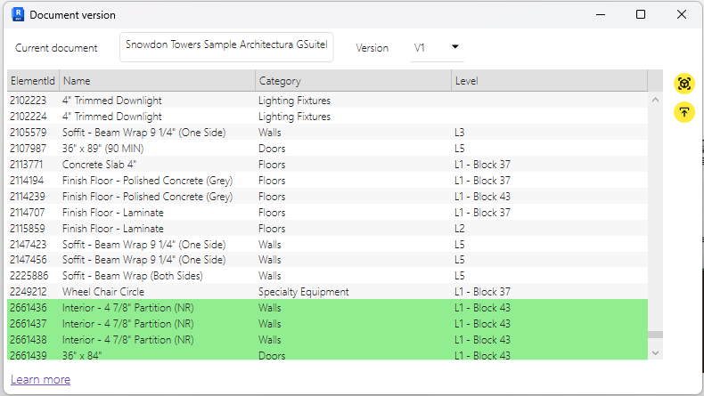
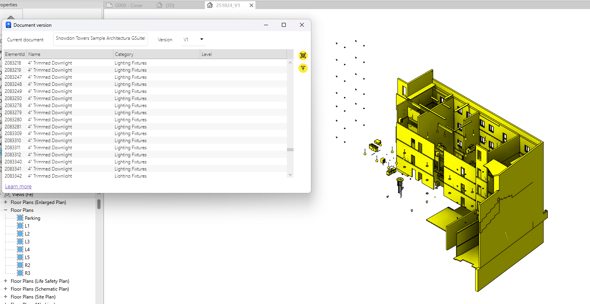
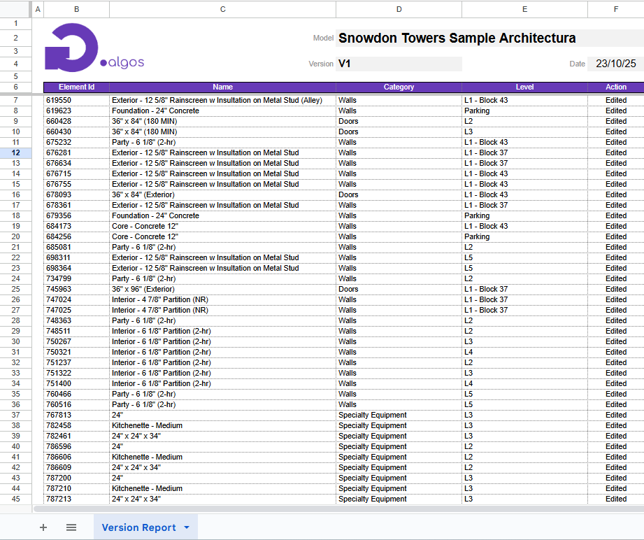

# File Versioning

The **File Versioning** feature allows users to track different versions of a document, visualize changes in 3D objects, and generate reports highlighting the differences between the current document state and previous versions.  

## Save Version

The **Save Version** command saves the current state of the document as a new version. This allows users to preserve progress and create checkpoints for comparison later.

## Version History

The **Version History** command opens a window where users can view all previously saved versions of the current document and inspect the differences.  

### Version List

The **Version List** displays all saved versions of the document. Users can select any version to compare it with the current document state.

### Main Table

The main table shows all **modified 3D elements**:

- **Green** — Elements that were added.
- **Red** — Elements that were removed.

Each row represents a single changed element, allowing users to quickly identify what has been modified.

### Right-side Actions

- **View** — Opens a new 3D view highlighting the changes: modified elements in **yellow**, newly added elements in **green**.

- **Export** — Generates a report of all changes in **.xlsx** format for documentation or sharing purposes.  

